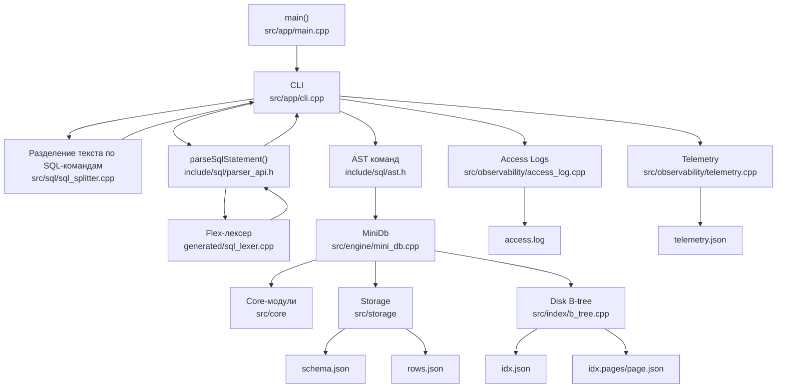

# Coursework B-tree DBMS

СУБД на C++17. Программа хранит базы данных в
файловой системе, поддерживает SQL-подобные команды и использует B-tree индексы
для полей

## Что реализовано

- базы данных: `CREATE DATABASE`, `DROP DATABASE`, `USE`;
- таблицы: `CREATE TABLE`, `DROP TABLE`;
- типы столбцов: `int`, `string`;
- ограничения: `NOT_NULL`, `INDEXED`;
- `INDEXED` автоматически делает поле `NOT_NULL` и уникальным;
- значения по умолчанию через `DEFAULT`;
- операции с данными: `INSERT`, `UPDATE`, `DELETE`, `SELECT`;
- условия `==`, `!=`, `<`, `>`, `<=`, `>=`, `BETWEEN`, `LIKE`;
- логические выражения `AND`, `OR` и группировка скобками в `WHERE`;
- агрегатные функции `COUNT`, `SUM`, `AVG`;
- вывод результата `SELECT` как JSON-массив;
- интерактивный режим и пакетный запуск SQL-файла;
- хранение схем, строк таблиц, B-tree индексов и страниц индексов в JSON-файлах;
- string interning для строковых значений в оперативной памяти;
- Access Logs в `_access.log`;
- Telemetry в `_telemetry.json` и команда `SHOW TELEMETRY;`.

Реализованные дополнительные задания: 2, 7, 8, 10, 11, 12.


## Структура проекта

```text
include/
  app/            заголовки CLI-интерфейса
  common/         общие строковые утилиты
  core/           значения, таблицы, условия, ограничения
  engine/         MiniDb и внутренний исполнитель команд
  index/          интерфейс B-tree индекса
  observability/  access logs и telemetry
  sql/            AST и публичный API парсера
  storage/        файловый ввод/вывод и JSON-кодирование

src/
  app/            main.cpp и CLI
  common/         реализации общих утилит
  core/           реализации core-модулей
  engine/         выполнение DDL/DML/SELECT
  index/          реализация B-tree
  observability/  логирование и метрики
  sql/            Flex/Bison грамматика и SQL helpers
  storage/        файловое хранение и JSON-кодирование

generated/
  sql_parser.cpp  сгенерированный Bison-парсер
  sql_parser.hpp  заголовок Bison-парсера
  sql_lexer.cpp   сгенерированный Flex-лексер

examples/
  runner.sql      основной демонстрационный сценарий
  runner1.txt     текстовая копия демонстрационного сценария

docs/
  cw2026.pdf      задания
```

Папка `storage/` создается и используется во время запуска программы. В ней
лежат уже созданные базы данных, таблицы, индексы, access log и telemetry.

## Общая схема



## Сборка

В корне проекта:

```bash
./build.sh
```

Скрипт собирает исполняемый файл:

```text
mini_btree_db
```

Если в папке `generated/` уже есть файлы `sql_parser.cpp`,
`sql_parser.hpp`, `sql_lexer.cpp`, скрипт использует их как есть и не
перегенерирует парсер. Если этих файлов нет, он создаст их через `bison` и
`flex`.

## Запуск

Интерактивный режим:

```bash
./mini_btree_db
```

Пакетный режим с демонстрационным сценарием:

```bash
./mini_btree_db --data-dir runner_storage examples/runner.sql
```

Если `--data-dir` не указан, программа использует папку `storage`:

```bash
./mini_btree_db examples/runner.sql
```

## Что показывает runner.sql

`examples/runner.sql` демонстрирует основное задание и дополнительные задания
2, 7, 8, 10, 11, 12:

- создание базы и таблиц;
- вставку, выборку, обновление и удаление записей;
- ограничения `NOT_NULL` и `INDEXED`;
- уникальность индексированных полей;
- значения по умолчанию `DEFAULT`;
- поиск по условиям `WHERE`, `BETWEEN`, `LIKE`;
- составные условия `AND`, `OR`, скобки;
- агрегаты `COUNT`, `SUM`, `AVG`;
- создание B-tree индексов на диске;
- запись access logs;
- вывод telemetry через `SHOW TELEMETRY;`;
- статистику string interning в telemetry.


